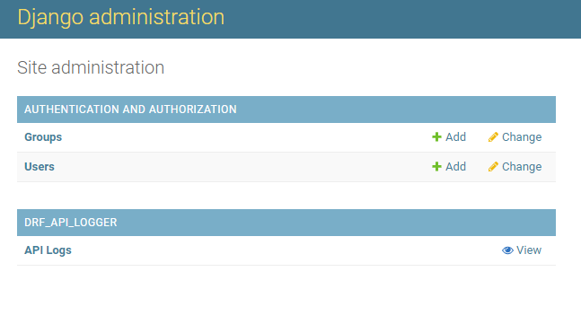
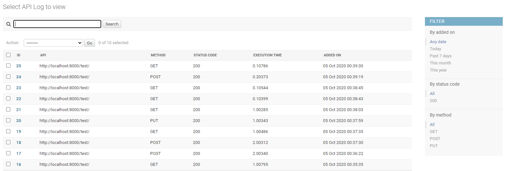
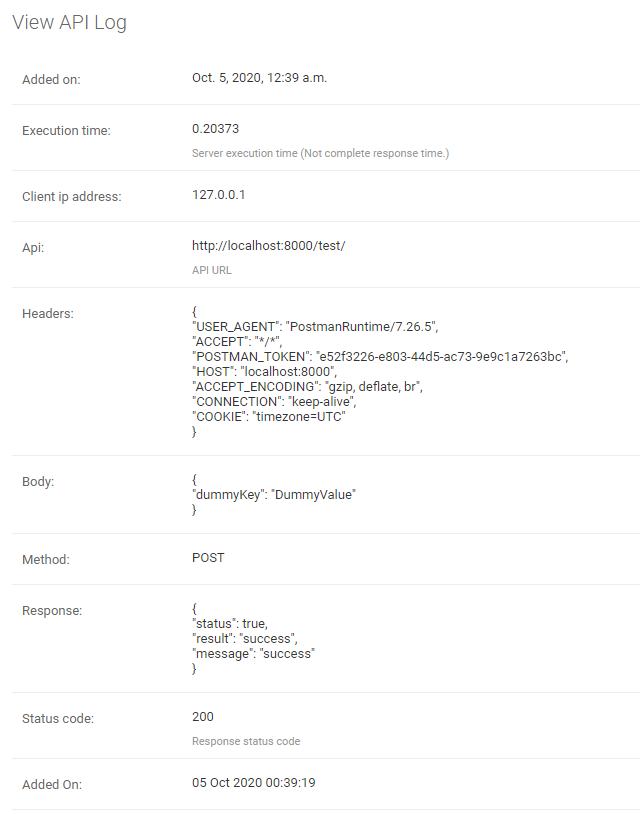

# DRF API Logger


An API Logger for your Django Rest Framework project.

It logs all the API information for content type "application/json".
1. URL
2. Request Body
3. Request Headers
4. Request Method
5. API Response
6. Status Code
7. API Call Time
8. Server Execution Time
9. Client IP Address


You can log API information into the database or listen to the logger signals for different use-cases or you can do both.

* The logger usage a separate thread to run so it won't affect your API response time.

## Installation

Install or add drf-api-logger.
```shell script
pip install drf-api-logger
```

Add in INSTALLED_APPS
```python
INSTALLED_APPS = [
    'django.contrib.admin',
    'django.contrib.auth',
    'django.contrib.contenttypes',
    'django.contrib.sessions',
    'django.contrib.messages',
    'django.contrib.staticfiles',

    'drf_api_logger',  #  Add here
]
```

Add in MIDDLEWARE
```python
MIDDLEWARE = [
    'django.middleware.security.SecurityMiddleware',
    'django.contrib.sessions.middleware.SessionMiddleware',
    'django.middleware.common.CommonMiddleware',
    'django.middleware.csrf.CsrfViewMiddleware',
    'django.contrib.auth.middleware.AuthenticationMiddleware',
    'django.contrib.messages.middleware.MessageMiddleware',
    'django.middleware.clickjacking.XFrameOptionsMiddleware',

    'drf_api_logger.middleware.api_logger_middleware.APILoggerMiddleware' # Add here
]
```


#### * Add these lines in Django Rest Framework settings file.

## Store logs into the database
Log every request into the database.
```python
DRF_API_LOGGER_DATABASE = True  # Default to False
```
Logs will be available in Django Admin Panel.







Note: Make sure to migrate. It will create a table for logger if "DRF_API_LOGGER_DATABASE" is True else if already exists, it will delete the table.

## To listen for the logger signals.
Listen to the signal as soon as any API is called. So you can log the API data into a file or for different use-cases.
```python
DRF_API_LOGGER_SIGNAL = True  # Default to False
```
Example code to listen to the API Logger Signal.
```python
"""
Import API_LOGGER_SIGNAL
"""
from drf_api_logger import API_LOGGER_SIGNAL


"""
Create a function that is going to listen to the API logger signals.
"""
def listener_one(**kwargs):
    print(kwargs)

def listener_two(**kwargs):
    print(kwargs)

"""
It will listen to all the API logs whenever an API is called.
You can also listen signals in multiple functions.
"""
API_LOGGER_SIGNAL.listen += listener_one
API_LOGGER_SIGNAL.listen += listener_two

"""
Unsubscribe to signals.
"""

API_LOGGER_SIGNAL.listen -= listener_one
```

### Queue

DRF API Logger usage queue to hold the logs before inserting into the database. Once queue is full, it bulk inserts into the database.

Specify the queue size.
```python
DRF_LOGGER_QUEUE_MAX_SIZE = 50  # Default to 50 if not specified.
```

### Interval

DRF API Logger also waits for a period of time. If queue is not full and there are some logs to be inserted, it inserts after interval ends.

Specify interval (In Seconds).
```python
DRF_LOGGER_INTERVAL = 10  # In Seconds, Default to 10 seconds if not specified.
```
### Skip namespace
You can skip the entire app to be logged into the database by specifying namespace of the app as list.
```python
DRF_API_LOGGER_SKIP_NAMESPACE = ['APP_NAMESPACE1', 'APP_NAMESPACE2']
```

### Skip URL Name
You can also skip any API to be logged by using url_name of the API.
```python
DRF_API_LOGGER_SKIP_URL_NAME = ['url_name1', 'url_name2']
```

Note: It does not log Django Admin Panel API calls.
